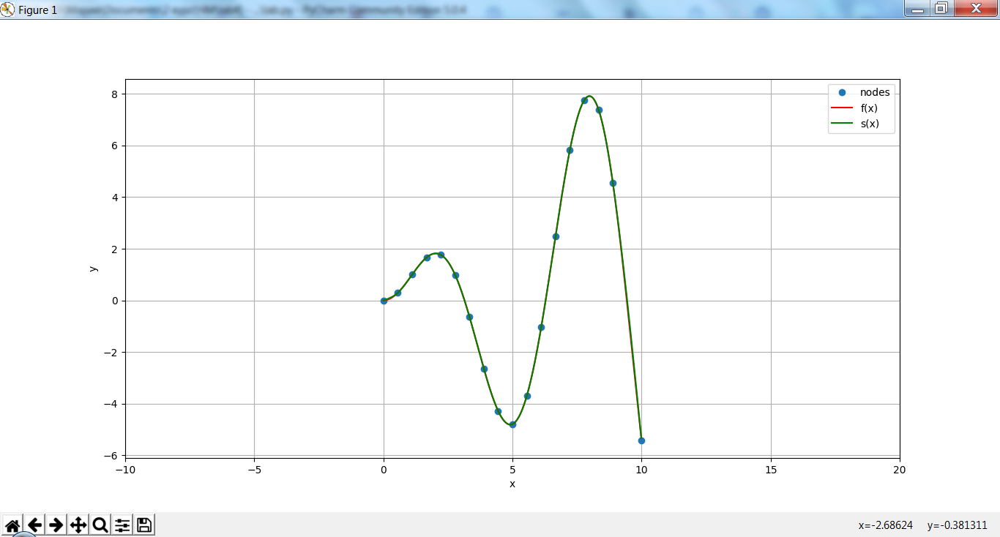

# knu_labs
<h2>Numerical Analysis (2-3 courses)</h2>
<ul>
<li>lab1</li>
<li>lab2</li>
<li>lab3</li>
<li>lab4</li>

Cubic spline interpolation
 input:
  n - nodes,
  segment,
  function.

Example:
 n=18
 segment=[0,10]
 function(x): x*np.sin(x)

  

